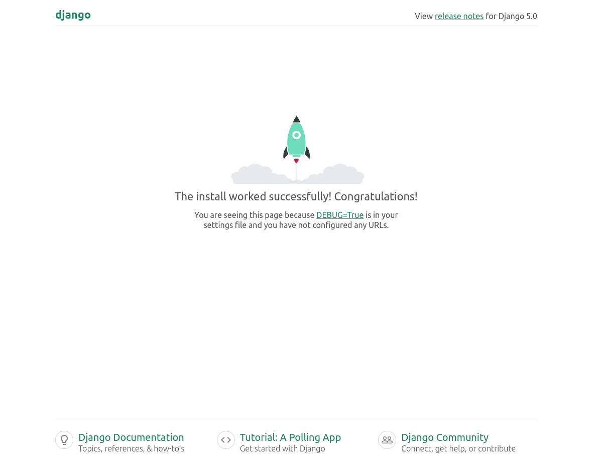

# GreenGear

## Перед началом работы

```

mkdir GreenGear
cd GreenGear
python3 -m venv venv
source venv/bin/activate
pip install -r requirements.txt
cd green_gear
python3 manage.py makemigrations
python3 manage.py migrate
pythom3 manage.py runserver

```
Переходим на http://localhost:8000/.
Получаем начальную страницу django или конкретный шаблон:


## Правила работы
1. Новый функционал -> новая ветка. Потом мерж в основную
2. В основной ветке ничего не правим. Только через мерж.
3. main - продакшен
